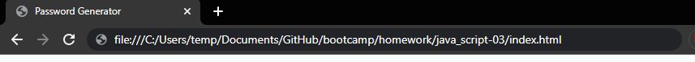

# Password Generator

## Description

Simple password generator built in JavaScript. Allows you to enter desired length and contents. Then builds a password with your selections.

## Table Of Cotents

- [Installation And Usage](#installation)
- [Usage](#Usage)
- [Git Pages](#pages)

## Installation
To get this up and runing simply download the repo. Extract and navigate your browser to the location of the index.html.

## Usage
Very simple to use first navagte to the index.html like shown above.
Next Click the big red button shown below

Next answer the questions being prompted.

Finally hover over the area to view the password. Or simply paste it where you want to because its in yuor clipboard.

(After pasting somewhere)

## Pages

If you would like to view this live. Github has this great utility called Gitpages where you can host stuff.
If you click [here](https://hahkeye.github.io/password-generator/)

